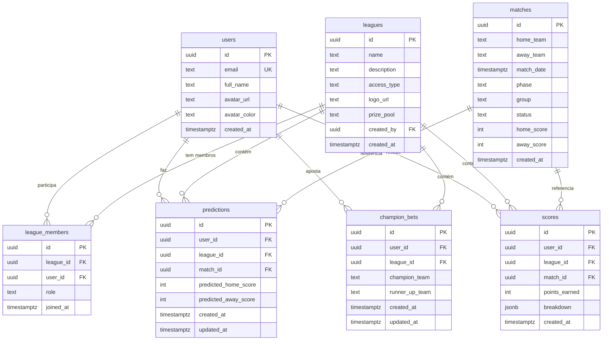

# Database Schema — Bolão da Copa 2026

## Diagrama ER

## Tabelas

### users
Espelha `auth.users` do Supabase. Preenchida via trigger em `auth.users`.

| Coluna | Tipo | Constraint |
|--------|------|------------|
| id | uuid | PK, = auth.uid() |
| email | text | UNIQUE NOT NULL |
| full_name | text | nullable |
| avatar_url | text | nullable |
| avatar_color | text | DEFAULT '#FFC72C' |
| created_at | timestamptz | DEFAULT NOW() |

### leagues
| Coluna | Tipo | Constraint |
|--------|------|------------|
| id | uuid | PK DEFAULT gen_random_uuid() |
| name | text | NOT NULL |
| description | text | nullable |
| access_type | text | CHECK ('open','private') |
| logo_url | text | nullable |
| prize_pool | text | nullable |
| created_by | uuid | FK → users(id) |
| created_at | timestamptz | DEFAULT NOW() |

**Seed:** `00000000-0000-0000-0000-000000000001` → "Test Bolão" (open)

### league_members
| Coluna | Tipo | Constraint |
|--------|------|------------|
| id | uuid | PK |
| league_id | uuid | FK → leagues(id) ON DELETE CASCADE |
| user_id | uuid | FK → users(id) ON DELETE CASCADE |
| role | text | DEFAULT 'member' CHECK ('member','admin') |
| joined_at | timestamptz | DEFAULT NOW() |
| — | — | UNIQUE(league_id, user_id) |

**Trigger:** `enroll_user_in_default_league` — executa `AFTER INSERT ON users`, insere o novo usuário em `league_id = '00000000-0000-0000-0000-000000000001'`.

### matches
| Coluna | Tipo | Constraint |
|--------|------|------------|
| id | uuid | PK |
| home_team | text | NOT NULL |
| away_team | text | NOT NULL |
| match_date | timestamptz | NOT NULL |
| phase | text | CHECK ('group','32nd','16th','8th','4th','semi','3rd_place','final') |
| group | text | nullable (ex: 'A', 'B') |
| status | text | DEFAULT 'scheduled' CHECK ('scheduled','live','finished') |
| home_score | integer | nullable |
| away_score | integer | nullable |
| created_at | timestamptz | DEFAULT NOW() |

### predictions
RLS: usuário pode apenas ler/escrever suas próprias linhas.

| Coluna | Tipo | Constraint |
|--------|------|------------|
| id | uuid | PK |
| user_id | uuid | FK → users(id) ON DELETE CASCADE |
| league_id | uuid | FK → leagues(id) ON DELETE CASCADE |
| match_id | uuid | FK → matches(id) ON DELETE CASCADE |
| predicted_home_score | integer | nullable |
| predicted_away_score | integer | nullable |
| created_at | timestamptz | DEFAULT NOW() |
| updated_at | timestamptz | DEFAULT NOW() |
| — | — | UNIQUE(user_id, league_id, match_id) |

### champion_bets
RLS: usuário pode apenas ler/escrever suas próprias linhas.

| Coluna | Tipo | Constraint |
|--------|------|------------|
| id | uuid | PK |
| user_id | uuid | FK → users(id) ON DELETE CASCADE |
| league_id | uuid | FK → leagues(id) ON DELETE CASCADE |
| champion_team | text | NOT NULL |
| runner_up_team | text | nullable |
| created_at | timestamptz | DEFAULT NOW() |
| updated_at | timestamptz | DEFAULT NOW() |
| — | — | UNIQUE(user_id, league_id) |

### scores
RLS: usuário pode apenas **ler** suas próprias linhas (sem escrita direta).

| Coluna | Tipo | Constraint |
|--------|------|------------|
| id | uuid | PK |
| user_id | uuid | FK → users(id) ON DELETE CASCADE |
| league_id | uuid | FK → leagues(id) ON DELETE CASCADE |
| match_id | uuid | FK → matches(id) ON DELETE SET NULL |
| points_earned | integer | NOT NULL |
| breakdown | jsonb | ex: `{"exact_match": 10, "phase_multiplier": 1}` |
| created_at | timestamptz | DEFAULT NOW() |

## RLS Policies

| Tabela | Operação | Condição |
|--------|----------|----------|
| predictions | ALL | `auth.uid() = user_id` |
| champion_bets | ALL | `auth.uid() = user_id` |
| scores | SELECT | `auth.uid() = user_id` |
