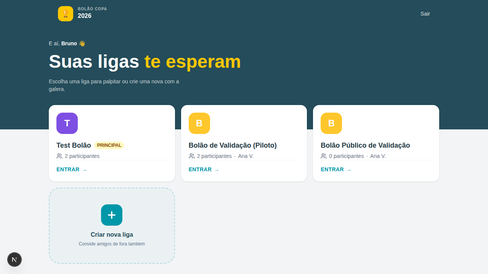
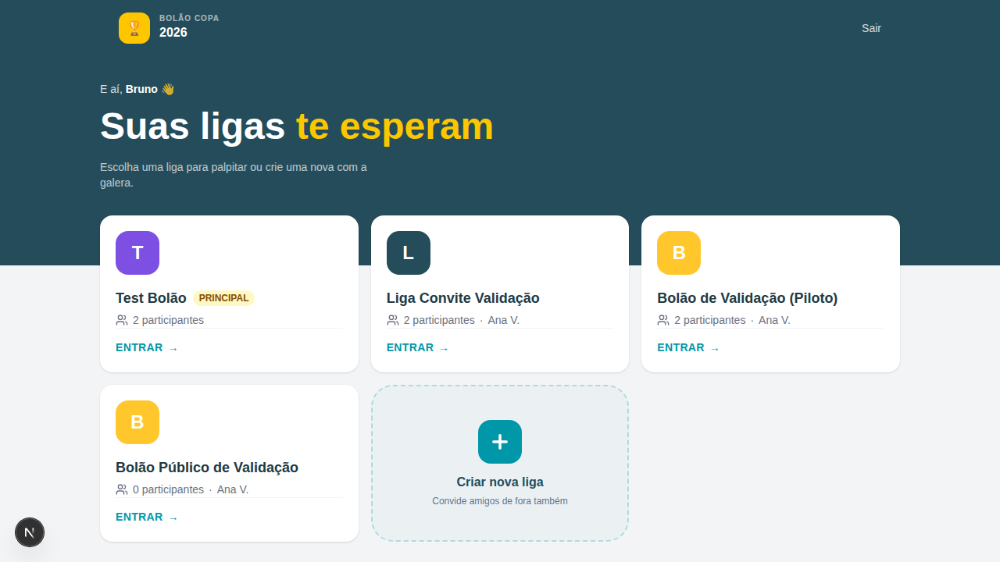
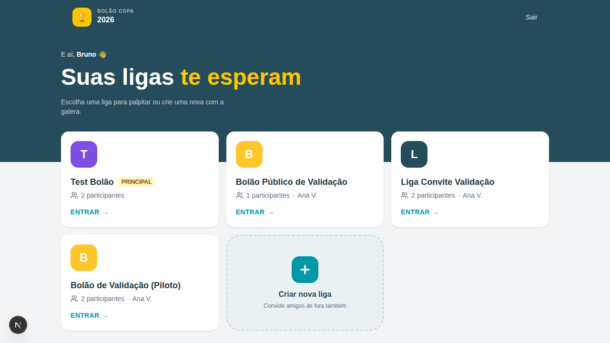
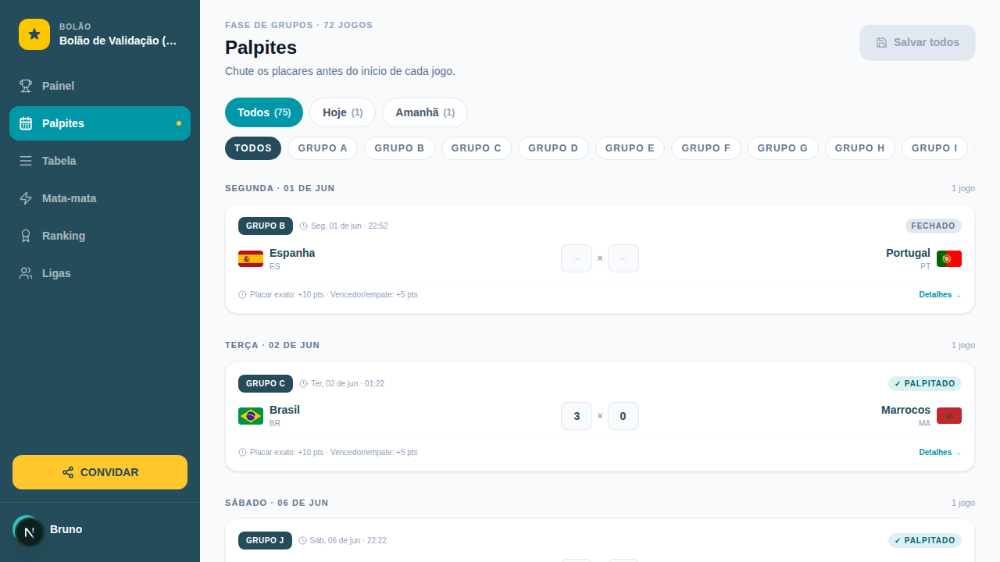
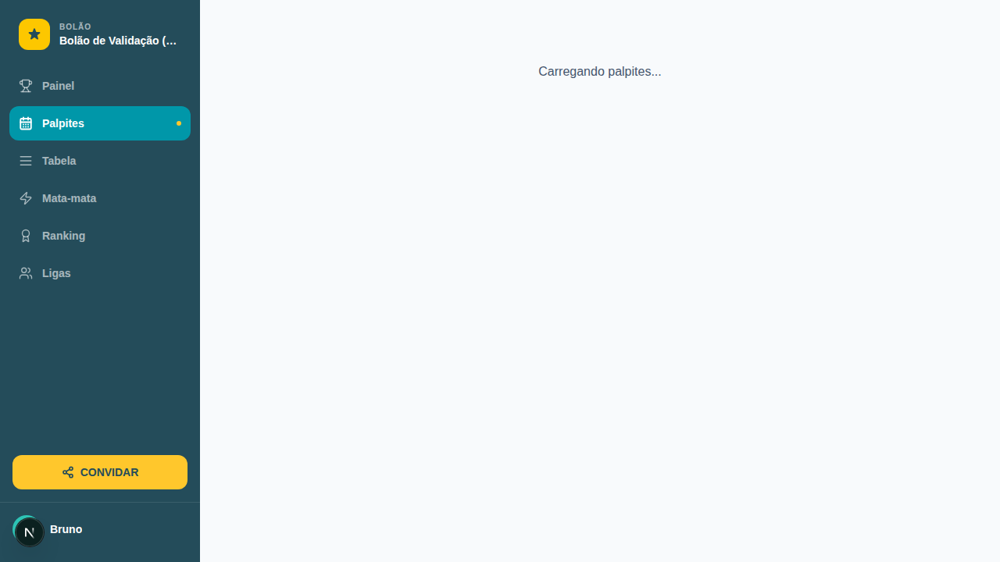
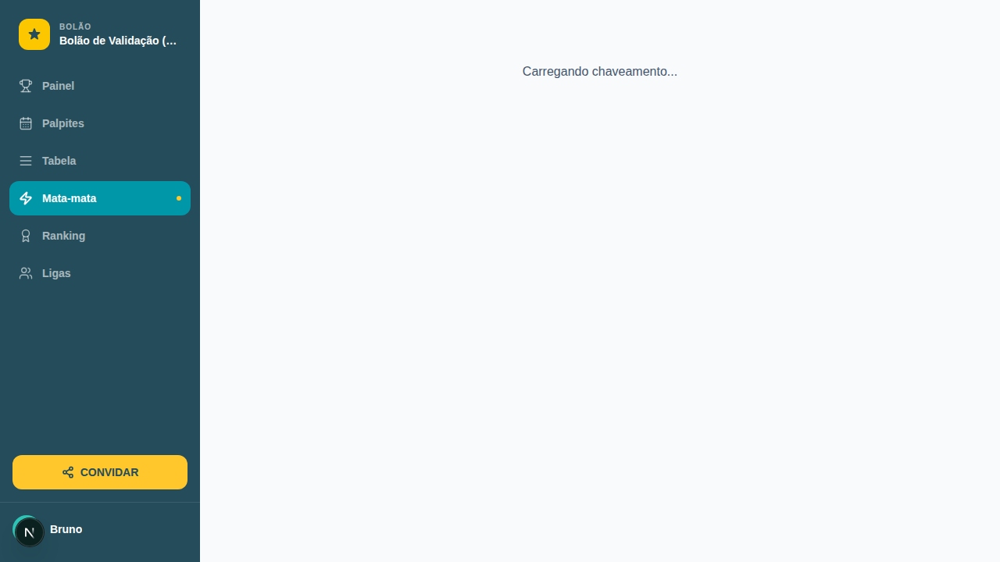
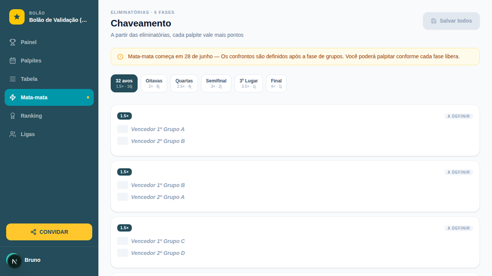
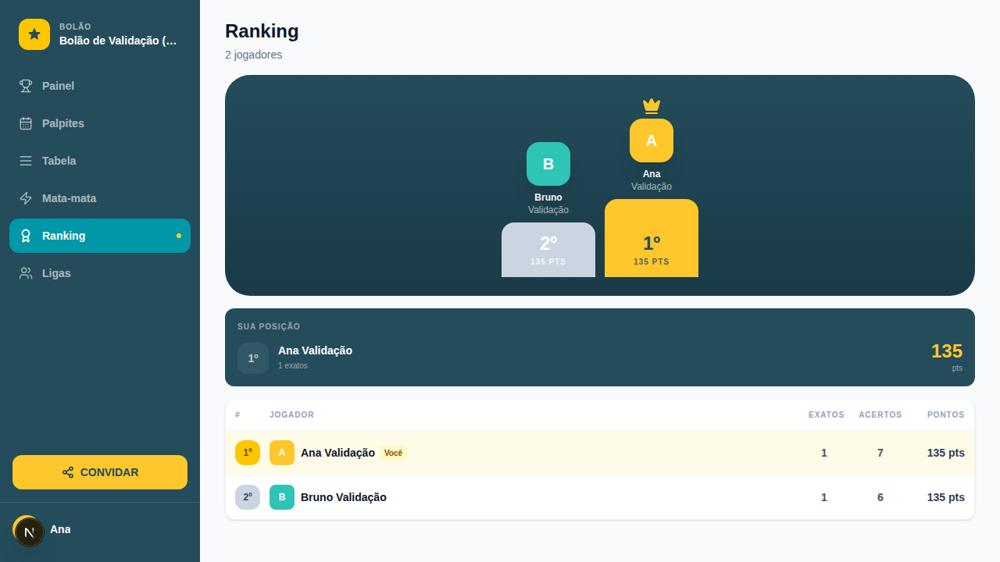

# Evidência de validação — execução automatizada

> Gerado por `tests/e2e/validation-run.spec.ts` (PRD football-api-ingestion, task_09 / ADR-009).
> Dois participantes (Ana + Bruno) percorrem os 7 cenários de `VALIDACAO-MANUAL.md` na UI real,
> sobre três estados pré-definidos do banco (pré-Copa → em andamento → encerrada).
> Reproduza com: `supabase start && npx playwright test`.

**Resultado:** 7/7 cenários · 19/19 passos ✅

Gerado em 2026-06-02T01:22:42.864Z.

## Resumo

| # | Cenário | Passo | Esperado | Observado | Resultado |
|---|---------|-------|----------|-----------|-----------|
| 1 | Cenário 1 | 1.1 Ana cria liga privada | HTTP 201 + liga criada com id | HTTP 201, id=cbde9fd5-d0db-41be-89ea-cd157f8fa810 | ✅ PASSOU |
| 2 | Cenário 1 | 1.3 Bruno entra com token errado | HTTP 403 INVALID_TOKEN | HTTP 403 INVALID_TOKEN | ✅ PASSOU |
| 3 | Cenário 1 | 1.2 Bruno entra com token válido | HTTP 200 + member_count incrementa para 2 | HTTP 200, member_count=2 | ✅ PASSOU |
| 4 | Cenário 1 | 1.4 Bruno tenta entrar de novo | HTTP 400 ALREADY_A_MEMBER | HTTP 400 ALREADY_A_MEMBER | ✅ PASSOU |
| 5 | Cenário 2 | 2.1/2.3 Descobrir lista só públicas | Liga pública aparece; privadas não | pública=true, privadas ocultas=true | ✅ PASSOU |
| 6 | Cenário 2 | 2.2 Entrar em liga pública sem token | HTTP 200 (token só exigido em privada) | HTTP 200 | ✅ PASSOU |
| 7 | Cenário 3 | 3.1/3.2 Palpite 2x1 salvo e persistido | HTTP 200; banco grava 2x1 | HTTP 200; banco=2x1 | ✅ PASSOU |
| 8 | Cenário 3 | 3.3 Reenviar palpite sobrescreve | HTTP 200; permanece 1 linha (upsert) | HTTP 200; linhas=1 | ✅ PASSOU |
| 9 | Cenário 3 | 3.5 Placar inválido rejeitado | HTTP 400 INVALID_BODY | HTTP 400 INVALID_BODY | ✅ PASSOU |
| 10 | Cenário 4 | 4.1 Jogo > 1h aceita palpite | HTTP 200 | HTTP 200 | ✅ PASSOU |
| 11 | Cenário 4 | 4.2 Jogo < 1h trava palpite | HTTP 403 DEADLINE_PASSED | HTTP 403 DEADLINE_PASSED | ✅ PASSOU |
| 12 | Cenário 4 | 4.3 Aposta de campeão antes do prazo | HTTP 200 (BET_DEADLINE 11/06 ainda no futuro) | HTTP 200 | ✅ PASSOU |
| 13 | Cenário 4 | 4.5 Campeão == vice rejeitado | HTTP 400 SAME_TEAM | HTTP 400 SAME_TEAM | ✅ PASSOU |
| 14 | Cenário 7 | 7.1 Mata-mata com times reais aceita palpite | HTTP 200 (Brasil x Argentina, nomes PT confirmados) | HTTP 200 | ✅ PASSOU |
| 15 | Cenário 7 | 7.2 Mata-mata com placeholder rejeita | HTTP 409 MATCH_NOT_CONFIRMED (slot 2A x 2B) | HTTP 409 MATCH_NOT_CONFIRMED | ✅ PASSOU |
| 16 | Cenário 5 | 5.x Pontuação por jogo finalizado | Ana: 135 pts, exact_scores=1, correct_outcomes=7 (10/×mult exato, 5/×mult acerto, 0 erro) | pts=135, exact=1, outcomes=7 | ✅ PASSOU |
| 17 | Cenário 5 | 5.7 Aposta de campeão pontua após a final | Bruno também 135 (palpites diferentes mas mesmo total + campeão/vice corretos) | Bruno pts=135 | ✅ PASSOU |
| 18 | Cenário 6 | 6.1/6.3 Ranking e desempate por cravada mais recente | Empate 135x135 → Ana em 1º (cravada na semi, mais recente); Bruno 2º (cravada no grupo) | 1º=Ana Validação (135), 2º=Bruno Validação (135) | ✅ PASSOU |
| 19 | Cenário 7 | 7.3/7.4/7.5 Pontuação do mata-mata e campeão | Semi finalizada (Brasil 2x1 Argentina, ×3) e Final (Brasil 1x0 Espanha, ×4) → campeão Brasil | semi=Brasil 2x1 Argentina; final=Brasil 1x0 Espanha | ✅ PASSOU |

## Passos com captura de tela

### 1. Cenário 1 — 1.1 Ana cria liga privada

- **Esperado:** HTTP 201 + liga criada com id
- **Observado:** HTTP 201, id=cbde9fd5-d0db-41be-89ea-cd157f8fa810
- **Resultado:** ✅ PASSOU

### 2. Cenário 1 — 1.3 Bruno entra com token errado

- **Esperado:** HTTP 403 INVALID_TOKEN
- **Observado:** HTTP 403 INVALID_TOKEN
- **Resultado:** ✅ PASSOU

### 3. Cenário 1 — 1.2 Bruno entra com token válido

- **Esperado:** HTTP 200 + member_count incrementa para 2
- **Observado:** HTTP 200, member_count=2
- **Resultado:** ✅ PASSOU

### 4. Cenário 1 — 1.4 Bruno tenta entrar de novo

- **Esperado:** HTTP 400 ALREADY_A_MEMBER
- **Observado:** HTTP 400 ALREADY_A_MEMBER
- **Resultado:** ✅ PASSOU

### 5. Cenário 2 — 2.1/2.3 Descobrir lista só públicas

- **Esperado:** Liga pública aparece; privadas não
- **Observado:** pública=true, privadas ocultas=true
- **Resultado:** ✅ PASSOU

### 6. Cenário 2 — 2.2 Entrar em liga pública sem token

- **Esperado:** HTTP 200 (token só exigido em privada)
- **Observado:** HTTP 200
- **Resultado:** ✅ PASSOU

### 7. Cenário 3 — 3.1/3.2 Palpite 2x1 salvo e persistido

- **Esperado:** HTTP 200; banco grava 2x1
- **Observado:** HTTP 200; banco=2x1
- **Resultado:** ✅ PASSOU

### 8. Cenário 3 — 3.3 Reenviar palpite sobrescreve

- **Esperado:** HTTP 200; permanece 1 linha (upsert)
- **Observado:** HTTP 200; linhas=1
- **Resultado:** ✅ PASSOU

### 9. Cenário 3 — 3.5 Placar inválido rejeitado

- **Esperado:** HTTP 400 INVALID_BODY
- **Observado:** HTTP 400 INVALID_BODY
- **Resultado:** ✅ PASSOU

### 10. Cenário 4 — 4.1 Jogo > 1h aceita palpite

- **Esperado:** HTTP 200
- **Observado:** HTTP 200
- **Resultado:** ✅ PASSOU

### 11. Cenário 4 — 4.2 Jogo < 1h trava palpite

- **Esperado:** HTTP 403 DEADLINE_PASSED
- **Observado:** HTTP 403 DEADLINE_PASSED
- **Resultado:** ✅ PASSOU

### 12. Cenário 4 — 4.3 Aposta de campeão antes do prazo

- **Esperado:** HTTP 200 (BET_DEADLINE 11/06 ainda no futuro)
- **Observado:** HTTP 200
- **Resultado:** ✅ PASSOU

### 13. Cenário 4 — 4.5 Campeão == vice rejeitado

- **Esperado:** HTTP 400 SAME_TEAM
- **Observado:** HTTP 400 SAME_TEAM
- **Resultado:** ✅ PASSOU

### 14. Cenário 7 — 7.1 Mata-mata com times reais aceita palpite

- **Esperado:** HTTP 200 (Brasil x Argentina, nomes PT confirmados)
- **Observado:** HTTP 200
- **Resultado:** ✅ PASSOU

### 15. Cenário 7 — 7.2 Mata-mata com placeholder rejeita

- **Esperado:** HTTP 409 MATCH_NOT_CONFIRMED (slot 2A x 2B)
- **Observado:** HTTP 409 MATCH_NOT_CONFIRMED
- **Resultado:** ✅ PASSOU

### 16. Cenário 5 — 5.x Pontuação por jogo finalizado

- **Esperado:** Ana: 135 pts, exact_scores=1, correct_outcomes=7 (10/×mult exato, 5/×mult acerto, 0 erro)
- **Observado:** pts=135, exact=1, outcomes=7
- **Resultado:** ✅ PASSOU

### 17. Cenário 5 — 5.7 Aposta de campeão pontua após a final

- **Esperado:** Bruno também 135 (palpites diferentes mas mesmo total + campeão/vice corretos)
- **Observado:** Bruno pts=135
- **Resultado:** ✅ PASSOU

### 18. Cenário 6 — 6.1/6.3 Ranking e desempate por cravada mais recente

- **Esperado:** Empate 135x135 → Ana em 1º (cravada na semi, mais recente); Bruno 2º (cravada no grupo)
- **Observado:** 1º=Ana Validação (135), 2º=Bruno Validação (135)
- **Resultado:** ✅ PASSOU

### 19. Cenário 7 — 7.3/7.4/7.5 Pontuação do mata-mata e campeão

- **Esperado:** Semi finalizada (Brasil 2x1 Argentina, ×3) e Final (Brasil 1x0 Espanha, ×4) → campeão Brasil
- **Observado:** semi=Brasil 2x1 Argentina; final=Brasil 1x0 Espanha
- **Resultado:** ✅ PASSOU

